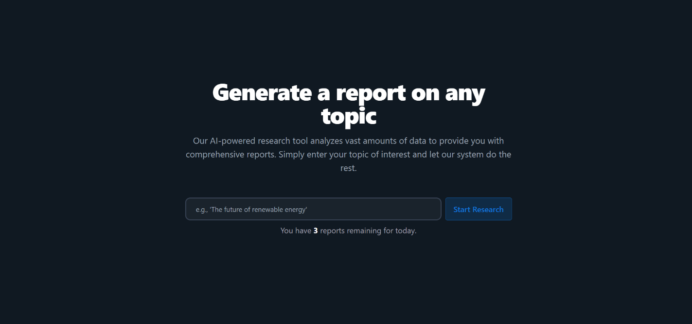
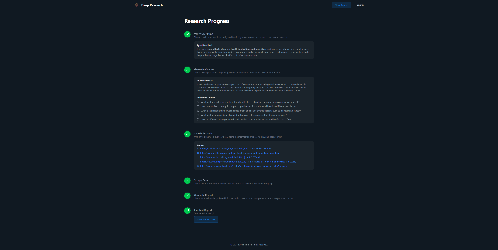
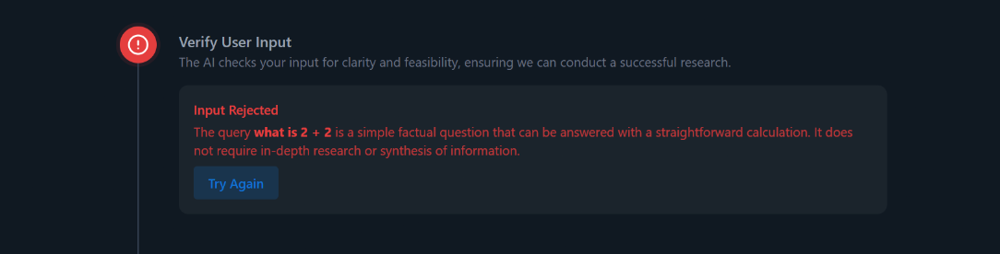
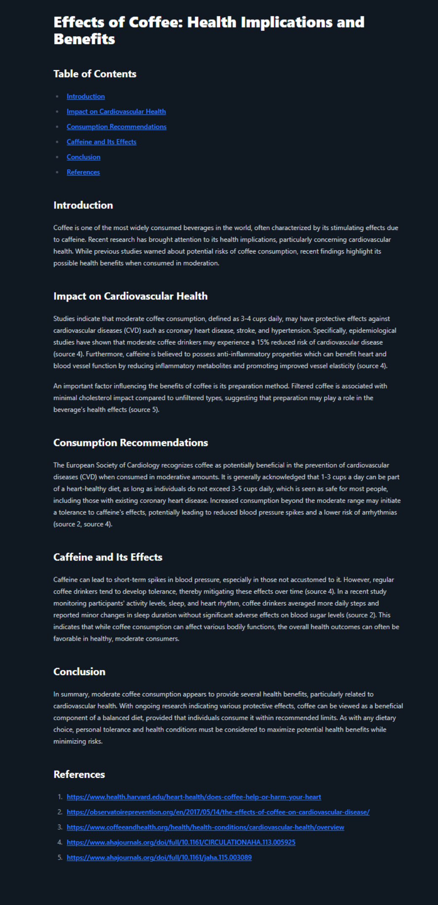
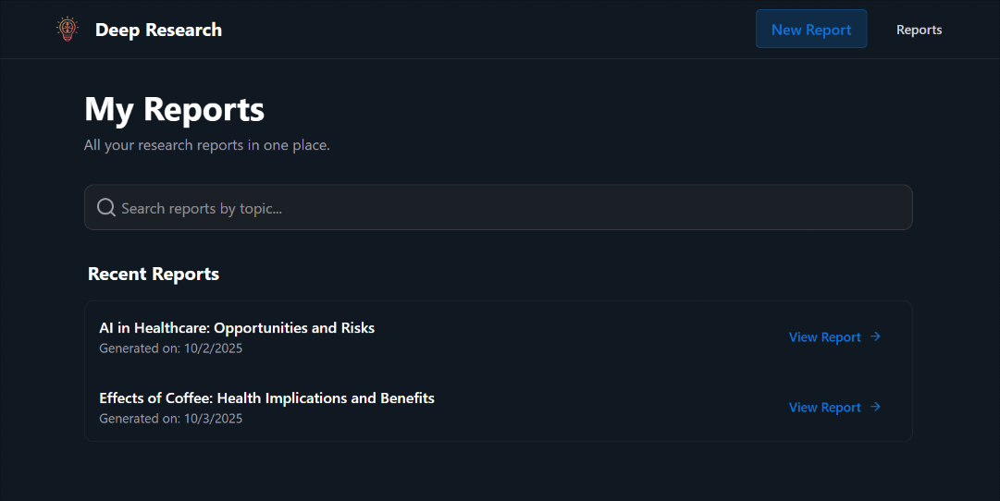

# Deep Research

## Agentic AI Deep Research App
An AI-powered tool that generates comprehensive research reports from a single user prompt using a multi-agent pipeline.

### Tech Stack
**Backend**: Python, FastAPI, OpenAI Agents SDK, MongoDB

**Frontend**: React, TailwindCSS, Shadcn, socket.io

### Features
- **Automated Multi-Agent Pipeline** – Each agent has a specialized role, from generating queries to compiling the final report.

- **Real-Time Progress Updates** – Users see exactly which step the system is on (query generation, web search, scraping, or report building).

- **Structured, High-Quality Reports** – Synthesized and formatted for readability and clarity.

- **Modern Frontend Experience** – Built with React, TailwindCSS, and Shadcn for a clean and responsive UI.

## How it Works
The user provides a topic or concept to research. Their input is passed through a series of **AI Agents**, each with its own role, instructions on which **LLM** to use, and the **expected output format**:

1. `input_guardrail`: 

    Used by the `queries_generator` agent as a safety and quality check for user queries. Its main purpose is to **evaluate whether a user’s query is worth pursuing for in-depth research**. The agent rejects queries that are:

   - Too vague or ambiguous to generate meaningful research questions
   - Clearly off-topic or irrelevant for the research context
   - Likely to produce trivial or low-value results

This also helps **save costs by preventing unnecessary execution** of the full pipeline of agents on queries that are unlikely to be valuable.

2. `queries_generator`:

    Breaks the user’s input into **multiple focused research questions** and provides a short explanation of why these questions are relevant. This reasoning helps ensure that the questions cover diverse aspects of the topic and guide the subsequent research process, laying a foundation for building the final report.

3. `web_searcher`:

   Uses the `WebSearch` tool to **identify reliable web pages and data sources** that may contain information relevant to the generated questions.

4. `scraper`:

   Scrapes the identified URLs to **extract the most relevant and actionable information** from each source. The agent filters out noise and irrelevant content, producing concise summaries that serve as the raw material for the final report.

5. `report_builder`:

   Takes the collected summaries and **synthesizes them into a well-structured research report**. The report includes a table of contents, introduction, main body, conclusion, and references. It ensures the content is coherent, formatted in markdown, and provides actionable insights while maintaining clarity and readability.

Agents send **progress updates** to the frontend in real time via WebSockets. Once the report is fully generated, the final report is **stored in MongoDB** so it can be accessed later through the `Reports` page.

## How to Use Deep-Research

Enter a topic on which you want a generated report. The number of daily report generations is **limited to 3**.

The app will show **progress and real-time updates** as the report is being generated.

If the guardrail agent rejects your input, it will display an error message with the reasoning for rejection

When the report is finished click the `View Report` button to go directly to the generated report

You can view all of your generated reports by navigating to the `Reports` page

## Try It Out
[Live Page](https://af-deep-research.netlify.app/)
